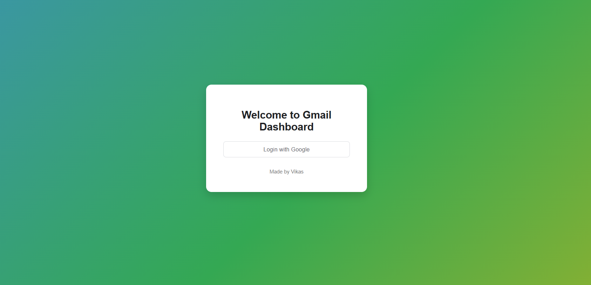

# Gmail Authentication & Mail Fetcher (Django + Google OAuth2)

A modern Django web application designed for secure user authentication via Google OAuth 2.0 and subsequent retrieval of the user's latest Gmail messages using the Gmail API. This project delivers a clean, professional user interface for both the login process and the inbox display.

##  Features

-  Secure Google Authentication: Implements the OAuth 2.0 flow for secure, token-based login.
-  Gmail Data Fetching: Fetches key email details (subject, sender, snippet) using the Gmail API.
-  Local Token Caching: Automatically saves the authentication token to a local `token.json` file for future sessions.
-  Beautiful Responsive UI: A user-friendly interface built with HTML5 and CSS3.
-  MVC Architecture: Structured according to the Django Model-View-Controller pattern.
-  Local Execution: Designed to run smoothly on `localhost:8000`.

##  Tech Stack

- Backend: Django 5.x
- Frontend: HTML5, CSS3 (simple responsive templates)
- APIs: Gmail API (Google OAuth 2.0)
- Language: Python 3.13
- Authentication libs: `google-auth`, `google-auth-oauthlib`, `google-auth-httplib2`, `google-api-python-client`

##  Project Structure

```
googleauth/
		manage.py
		credentials.json  # Google OAuth client credentials (DOWNLOADED)
		token.json        # Auto-created after first successful login (CACHED)

		googleauth/       # Main Django Project Configuration
		├── settings.py
		├── urls.py
		└── ...

		gmail_auth/       # Django App with Core Logic
				views.py      # Core Auth and Gmail API logic
				urls.py
				templates/
						login.html  # Login UI
						email.html  # Inbox UI
```

##  Setup Instructions

1. Clone & navigate

```powershell
git clone https://github.com/VIKASHL25/Google-Authentication-and-Fetching-Mails.git
cd gmail-auth-django
```

2. Create a virtual environment

```powershell
python -m venv venv

venv\Scripts\Activate

```

3. Install dependencies

```powershell
pip install -r requirements.txt
```

4. Google Cloud Setup (Critical)

This project requires configuring a project and enabling the Gmail API on the Google Cloud Console.

- Create a Project in the Google Cloud Console.
- Enable Gmail API: APIs & Services → Library → search for Gmail API → Enable.
- Configure OAuth Consent Screen:
	- User Type: External (for testing)
	- Add app name, support email, and test users (your Gmail account) and save.
- Create OAuth Credentials:
	- APIs & Services → Credentials → Create Credentials → OAuth Client ID
	- Application type: Web application
	- Authorized redirect URIs: `http://localhost:8000/google/callback/`
	- Click Create → Download the JSON file.
	- Rename the downloaded file to `credentials.json` and place it next to `manage.py`.

5. Run the project

```powershell
python manage.py migrate
python manage.py runserver
```

Open your browser at: http://127.0.0.1:8000/

Click "Login with Google" to begin the OAuth flow. After successfully authenticating, `token.json` will be created in the project root and you'll be able to view the latest messages pulled from the Gmail API.

## Requirements

Create a `requirements.txt` in the project root with at least the following lines:

```
Django>=5.0
google-auth
google-auth-oauthlib
google-auth-httplib2
google-api-python-client
```

## Usage Notes & Security

- Keep `credentials.json` private. Do not commit it to version control. Add it to `.gitignore`.
- `token.json` contains OAuth tokens; treat it as sensitive and add to `.gitignore` as well in production scenarios.
- For production use, consider server-side secure storage for tokens and implement proper session management.

## Screenshots





## Author

Vikas HL

- BE in Information Science & Engineering
- Passionate about Python, AI, Machine Learning and Deep Learning 
- Email: vikaslokesh360@gmail.com


